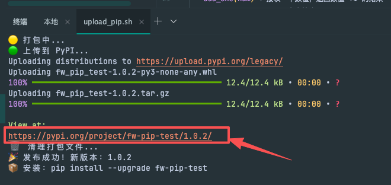

# fw-pip-test
fuwenquant 的 Python 测试包，包含基础的数值计算和字符串返回函数（仅用于测试 PyPI 包发布流程，适合新手学习包打包/上传全流程）。

第一次使用也请跳这段，直接详细见后面的功能说明
    常用步骤（第n次使用时）：
        PIP 包更新
            1、更新代码（如修复bug、新增功能等），执行 upload_pip.sh 脚本
               

        前端使用：
            1、pip install fw-pip-test
    

        查看包信息:  pip show fw-pip-test

常用问题：
    1、如何修改 pip 包的名称？
        解：在 setup.py 中 setup() 函数修改 name 参数，如 `name="fuwenquant-pip-test"`
    2、如何修改 pip 包的版本号？
        解：一般默认会自动更新版本号，如果 硬要指定，请设置 setup.py中的`VERSION` 变量，如 `VERSION = "1.0.2"`。
    3、如何查看已发行成功的包？
        解：在执行了 upload_pip.sh 脚本后，点击控制台返回的 URL 即可查看已发行成功的包。，如：https://pypi.org/project/fw-pip-test/1.0.2/



## 功能说明
该测试包包含核心基础函数：
- `add_one(num)`：接收一个数值，返回数值 +1 的结果
- `helloworld()`：返回固定字符串 "Hello World (fw-pip-test)"

## 环境准备
### 1. 依赖安装
确保本地安装必备工具包：
```bash
pip install --upgrade setuptools wheel twine requests packaging
```

### 2. 配置 PyPI 令牌
在项目根目录创建 `.env` 文件，配置 PyPI 官方令牌（需提前在 [PyPI 官网](https://pypi.org/) 注册账号并生成 API Token）：
```env
# .env 文件内容
PYPI_API_TOKEN=your_pypi_api_token_here  # 替换为真实的PyPI令牌
```

## 包上传流程
### 1. 赋予脚本执行权限（首次执行）
```bash
chmod +x publish.sh
```

### 2. 执行上传脚本
#### 普通模式（默认，简洁输出）
```bash
./publish.sh
```

#### 调试模式（详细日志，便于排查问题）
```bash
./publish.sh --debug  # 或 -d
```

### 上传脚本特性
- 自动清理旧打包文件（dist/build/egg-info）
- 支持动态包名（默认取脚本所在目录名）/手动指定包名
- 调试模式保留打包产物，非调试模式自动清理
- 上传失败自动提示排障方案

## 包使用指南
### 安装/更新包
```bash
# 安装最新版本
pip install fw-pip-test

# 强制更新到最新版本
pip install --upgrade fw-pip-test
```

### 基础使用示例

```python
# 导入包内函数
from fw_pip import add_one, helloworld

# 调用 helloworld 函数
print(helloworld())  # 输出：Hello World (fw-pip-test)

# 调用 add_one 函数
result = add_one(99)
print(result)  # 输出：100

result2 = add_one(10.5)
print(result2)  # 输出：11.5
```

## 版本规则
- 版本遵循 [语义化版本规范](https://semver.org/)，格式为 `主版本.次版本.小版本`（如 1.0.0）
- 脚本会自动查询 PyPI 上该包的最新版本，自动递增小版本号（首次发布为 1.0.0）
- 若需修改主/次版本，可修改 `setup.py` 中 `base_version` 参数（如改为 "1.1" 则版本从 1.1.0 开始递增）

## 注意事项
1. PyPI 包名全网唯一，若 `fw-pip-test` 已被占用，需修改 `setup.py` 和 `upload_pip.sh` 中的包名常量
2. 作者邮箱需与 PyPI 注册邮箱一致，否则上传会失败
3. 网络异常时，`setup.py` 中的版本查询逻辑会抛出异常，可临时改为手动指定版本：
   ```python
   # 在 setup.py 中替换版本自动获取逻辑
   VERSION = "1.0.0"  # 手动指定版本号
   ```
4. 若上传失败，优先使用 `--debug` 模式重新执行，查看详细错误日志（如令牌无效、包名重复、版本重复等）

## 许可证
该项目基于 MIT 许可证开源，详见项目根目录 LICENSE 文件（若未创建，可参考 [MIT 许可证模板](https://opensource.org/licenses/MIT)）。