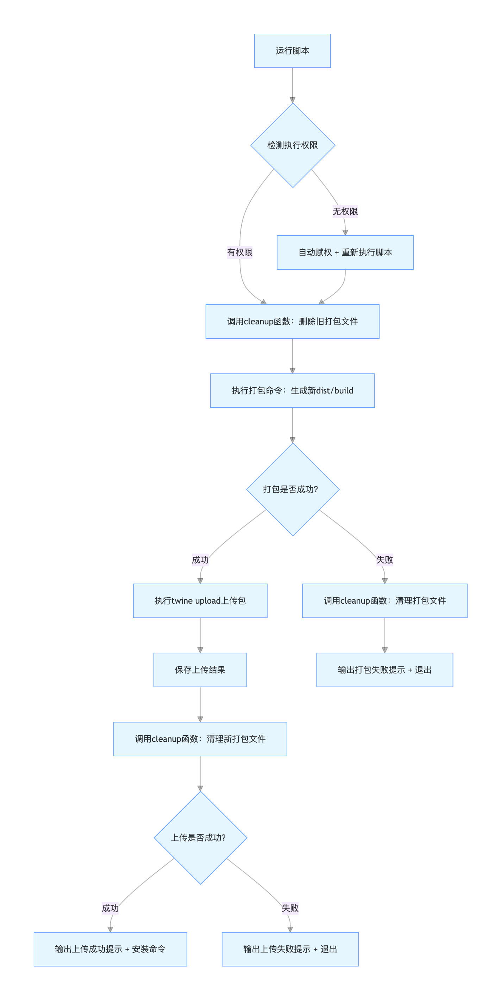

第一部分：使用频率最高（特别是更新版本）
最常用内容（如：fw-pip-test)
    删除旧打包资料       rm -rf dist/ build/ fw-pip_test.egg-info/
    打包              python setup.py sdist bdist_wheel
    上传              twine upload dist/*
    使用：             pip install --upgrade fw-pip-test --index-url https://pypi.org/simple/

.env环境
    请新增 PYPI_API_TOKEN=你的token

pycharm中右键setup.py，点击终端
1、注册pypi账号：https://pypi.org/account/register/
2、准备包源码（如：setup.py, fw_pip_test/bin/core.py）
3、打包：  
    安装打包工具：           pip install setuptools wheel twine
    删除旧环境包：      
    打包：                  python setup.py sdist bdist_wheel
    本地测试：
        pip uninstall -y fw-pip-test  # 先卸载旧版本            
        pip install dist/fw_pip_test-1.0.0-py3-none-any.whl
        python3 -c "from fw_pip_test.bin.core import add_one, helloworld; print(add_one(5)); print(helloworld())"
4、上传（发布包）
    twine upload dist/*
5、使用：
    pip uninstall -y fw-pip-test  # 卸载旧版本      
    pip install fw-pip-test

    直接官方下载版本：pip install fw-pip-test==1.0.1 --index-url https://pypi.org/simple/

# 详细说明，图文，操作步骤，BUG处理(第一次)
    任务说明：完成一个叫《fw-pip-test》的pip可全球下载安装的功能。
    环境：MAC,PYCHARM
    准备工作：
        https://pypi.org/account/register/ 注册一个pypi账号   

    若输出6和hello fw-pip!，说明包功能正常。

    生成依赖文件:         pip freeze > requirements.txt
    安装依赖文件：         pip install -r requirements.txt        
